# PiTV
Watch TV via FritzBox IPTV on Samsung Tizen Smart TV using Raspberry Pi Tvheadend and SS IPTV

Tested on:
- Raspberry Pi 3B
- Samsung Smart TV (Tizen) GQ50QN92AATXZG
- FritzBox 6660 Cable

## Prerequisites

1. [Install OS](https://www.raspberrypi.com/documentation/computers/getting-started.html#using-raspberry-pi-imager)

   - Raspberry Pi 3B has 64-bit CPU
   - Raspberry Pi 3B has no 5 GHz (only 2.4 GHz)
   - Check additional settings to configure headless mode
2. Update dependencies

    ```
   sudo apt-get update
   sudo apt-get ugpgrade
   ```

3. Increase GPU memory

   `sudo raspi-config`

   - Performance Options -> GPU memory -> 256

4. Connect Rasperry Pi via LAN to router, otherwise HD channels will not work properly

5. Install SS IPTV on Samsung Smart TV with Tizen OS

    - Unzip ssiptv_tizen_usb.zip to root of USB stick
    - Plug stick into TV
    - Confirm installation
    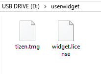

## Steps


1. Install Tvheadend

    `sudo apt install tvheadend`
2. Add _satip_xml parameter_

    ```
   sudo service tvheadend stop
   sudo nano /lib/systemd/system/tvheadend.service
   ```
   
    > ExecStart=/usr/bin/tvheadend -f -p /run/tvheadend.pid --satip_xml http://192.168.178.1:49000/satipdesc.xml $OPTIONS

    _192.168.178.1 is the IP of the FritzBox_

    `sudo service tvheadend start`
3. Open [Tvheadend](http://<pi-address>:9981) and verify that Configuration -> DVB Inputs -> TV adapters shows the FritBox tuners 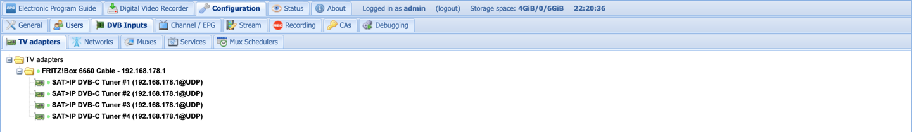  

4. Setup tuners, networks, services, and muxes
   - Make sure all networks, services, and muxes are empty
   - Create a network
     - Enabled
     - Unitymedia
     - Create bouquet
     - New muxes + changed muxes discovery
     - Skip startup scan
   - Go to tuners and assign **only one** to the network
   - Create Muxes
     - Enabled
     - EPG-scan Auto-detect
     - EPG module id: EIT: EPG Grabber
     - DVB-C
     - Frequency 338000000
     - Symbol rate 6900000
     - Constellation QAM/256
     - FEC 4/5 (3/5 is wrong in the image and doesn't exist)
     - PLP -1
   - Wait for Mux scan to finish
   - Assign remaining tuners to network
   - Go to services and download all desired channel links
   - Result
   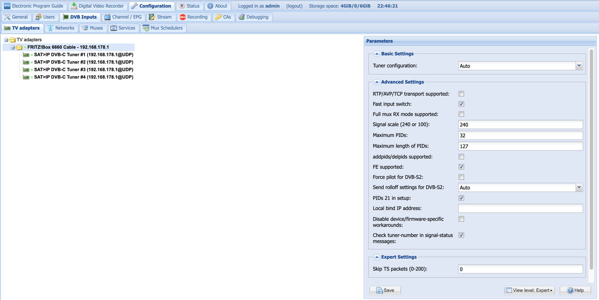
   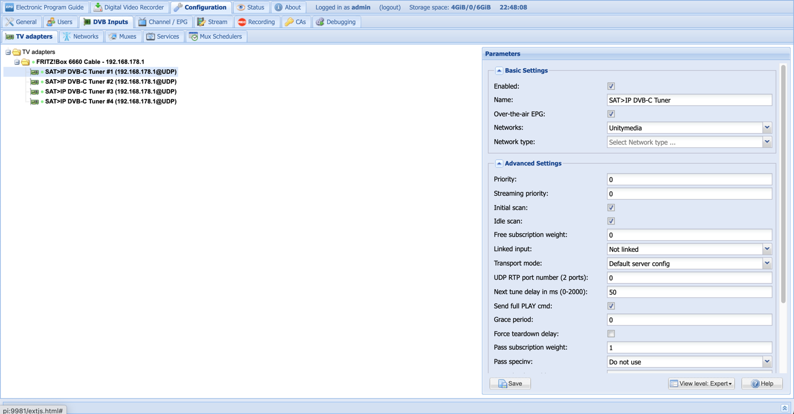
   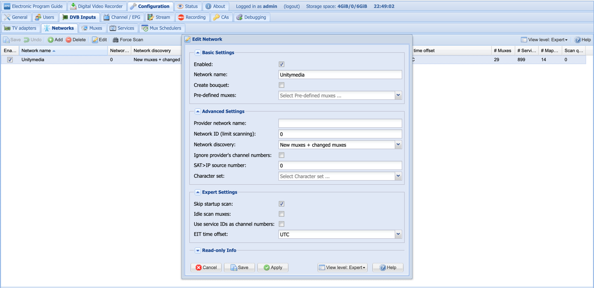
   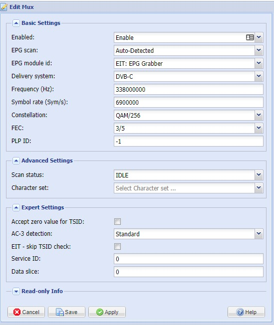
   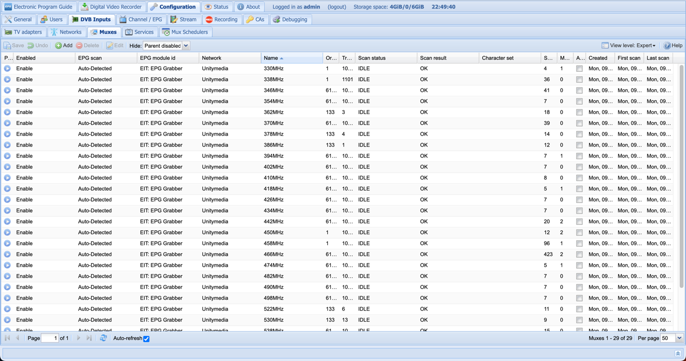
   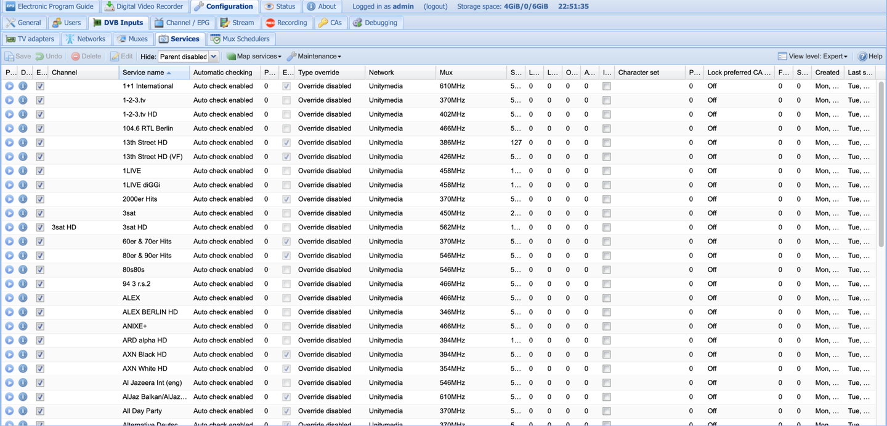
5. Setup EPG in Tvheadend
   - Go to Configuration -> Channel / EPG -> Channels
   - Add channels
     - Enabled
     - Name (can be anything)
     - Services (real channel name)
     - Automatically name from network (might need to set again after creation)
   - Configuration -> Channel / EPG -> EPG Grabber Modules
   - Disable all but OTA EIT: EPG Grabber
   - Result
   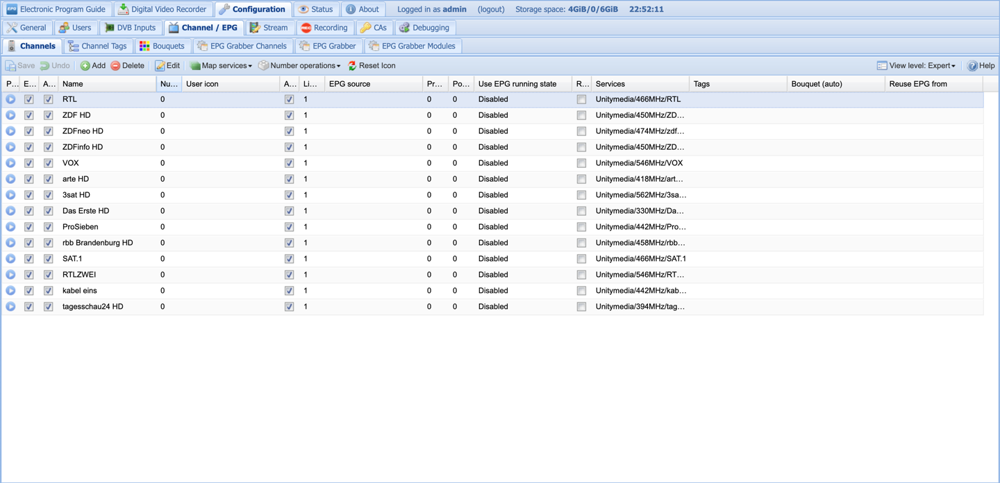
6. Setup user/ access
    - Go to Configuration -> Users -> Access Entries
    - Add user with wildcard * (aka default user), restrict access to local network, allow streaming + recording
    - No password added
    - In Configuration -> General -> Base, set authentication type to Both plain and digest
    - Result
   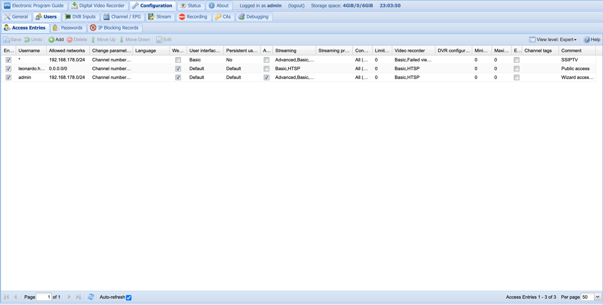
   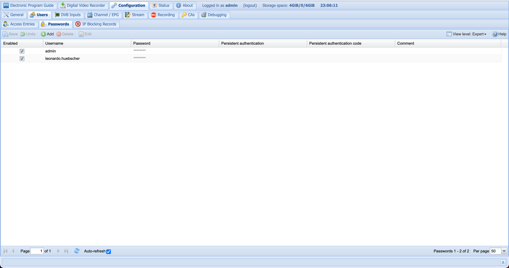
   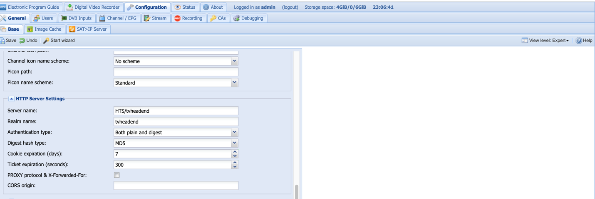
7. Test access via VLC

8. Prepare m3u playlist

    - Pay attention to setting `x-tvg-url="http://<PI-address>/epg.xml"`
    - Load EPG via `http://<pi-address>:9981/xmltv/channels`
    - Set _tvg-id_ using EPG from XML
9. Install & configure nginx

    ```
   sudo apt-get install nginx
   sudo nano /etc/nginx/sites-available/default
   ```

    ```
   location /epg.xml {
        gzip off;
        add_header 'Access-Control-Allow-Origin' '*';
        add_header 'Access-Control-Allow-Methods' 'GET, POST, OPTIONS, HEAD';
        add_header 'Access-Control-Allow-Headers' 'Range';
        add_header 'Access-Control-Expose-Headers' 'Accept-Ranges, Content-Encoding, Content-Length, Content-Range';
    }   
   ```
   
    ```
   sudo service nginx reload
   sudo wget http://<pi-address>:9981/xmltv/channels -O /var/www/html/epg.xml
   sudo nano /var/www/html/PiTV.m3u
   ```
   
    _use created PiTV based on the one from repository_
10. Setup EPG cronjob

    ```
    sudo crontab -e
    ```

    > 0 */4 * * * sudo wget http://<pi-address>:9981/xmltv/channels -O /var/www/html/epg.xml
 
11. Configure SS IPTV
    - Setup connection in [playlist editor](https://ss-iptv.com/en/users/playlist)
    - Add external playlist using local pi address (mDNS works)
    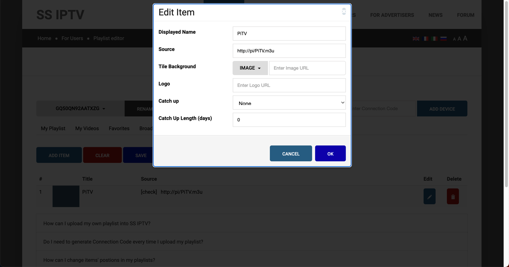
